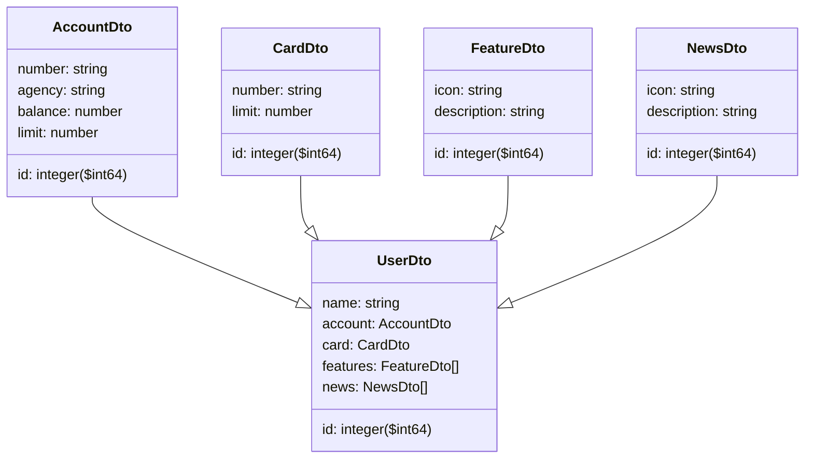

# santander-bootcamp-2023
Java RESTful API construída em Java 17 com Spring Boot 3 para a avaliação final do bootcamp santander 2023 - Fullstack Java + Angular

## 🚀 Tecnologia

- ⚡ Java é uma linguagem multiplataforma, orientada a objetos e centrada em rede que pode ser usada como uma plataforma em si. É uma linguagem de programação rápida, segura e confiável para codificar tudo, desde aplicações móveis e software empresarial até aplicações de big data e tecnologias do servidor.

- ## ✋🏻 Pré-requisitos

- [git](https://git-scm.com/downloads): Ferramenta para gerenciar o código-fonte

- [Visual Studio Code](https://code.visualstudio.com/): Editor de Código Fonte.

- [Node.js](https://nodejs.org/en): Software de código aberto, multiplataforma, baseado no interpretador V8 do Google e que permite a execução de códigos JavaScript fora de um navegador web.

- [Java 17](https://jdk.java.net/java-se-ri/17): É o mais recente lançamento de Suporte de Longo Prazo (LTS).

- [Spring Boot 3.0](https://spring.io/blog/2022/05/24/preparing-for-spring-boot-3-0): É um framework importante para o desenvolvimento Java devido à sua capacidade de simplificar tarefas e acelerar o desenvolvimento de aplicativos.

- [Spring Data JPA](https://spring.io/projects/spring-data-jpa): É um framework que tem como finalidade tornar a integração de aplicações Spring com a JPA (Java Persistence API).

## Diagrama de Classes

## :hammer_and_wrench: Antes de iniciar o projeto.

No diretório do projeto, inicialize o projeto e instale as dependências:

  ### `npm install`
  
  Instala as dependências.
